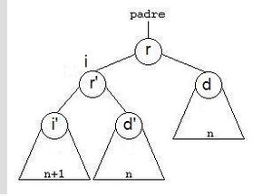

# Ayudantía 7

### Contenidos
* Árboles AVL

### Árbol AVL

Es un tipo especial de árbol binario el cual es auto-balanceable.

Los árboles AVL están siempre equilibrados de tal modo que para todos los nodos, la altura del sub-árbol izquierdo no difiere en más de una unidad de la altura del sub-árbol derecho o viceversa. 

La complejidad de una búsqueda en uno de estos árboles se mantiene siempre en orden de complejidad O(log n).

### Factor de equilibrio

El factor de equilibrio es la diferencia entre las alturas del sub-árbol derecho y el izquierdo:

    FE = altura sub-árbol derecho - altura sub-árbol izquierdo

Por definición, para un árbol AVL, este valor debe ser -1, 0 ó 1.

Si el factor de equilibrio de un nodo es:

    0 -> el nodo está equilibrado y sus subárboles tienen exactamente la misma altura.
    1 -> el nodo está equilibrado y su subárbol derecho es un nivel más alto.
    -1 -> el nodo está equilibrado y su subárbol izquierdo es un nivel más alto.

Si el factor de equilibrio |Fe|>=2 es necesario reequilibrar.

### Rotaciones
Las rotaciones se realizan para mantener el árbol perfectamente balanceado. El balanceo se produce de abajo hacia arriba sobre los nodos en los que se produce el desequilibrio. Pueden darse dos casos: rotación simple o rotación doble; a su vez ambos casos pueden ser hacia la derecha o hacia la izquierda.

* Rotación simple a la derecha

    De un árbol de raíz (r) y de hijos izquierdo (i) y derecho (d), lo que haremos será formar un nuevo árbol cuya raíz sea la raíz del hijo izquierdo. Como hijo izquierdo colocamos el hijo izquierdo de i y como hijo derecho construimos un nuevo árbol que tendrá como raíz, la raíz del árbol, el hijo derecho de i será el hijo izquierdo y el hijo derecho será el hijo derecho del árbol.

* Rotación simple a la izquierda

    De un árbol de raíz (r) y de hijos izquierdo (i) y derecho (d), consiste en formar un nuevo árbol cuya raíz sea la raíz del hijo derecho, como hijo derecho colocamos el hijo derecho de d (nuestro d’) y como hijo izquierdo construimos un nuevo árbol que tendrá como raíz la raíz del árbol (r), el hijo izquierdo de d será el hijo derecho (i’) de r y el hijo izquierdo será el hijo izquierdo del árbol (i).

    Precondición : Tiene que tener hijo derecho no vacío.

    Si la inserción se produce en el hijo derecho del hijo izquierdo del nodo desequilibrado (o viceversa) hay que realizar una doble rotación.

* Rotación doble a la derecha

    La Rotación doble a la Derecha son dos rotaciones simples, primero rotación simple izquierda y luego rotación simple derecha.

* Rotación doble a la izquierda

    kLa Rotación doble a la Izquierda son dos rotaciones simples, primero rotación simple derecha y luego rotación simple izquierda.

### Ejercicios

1. Dibuje el AVL resultante de insertar cada uno de los valores 35, 18, 9, 58, 14, 49, 51, 67, 60, en ese orden. El AVL es inicialmente vacio. Dibuje cada uno de los pasos de la inserción, así como las rotaciones producidas.
2. Dibuje el AVL resultante de insertar cada uno de los valores 13, 7, 21, 15, 27, 18, 4, 11, 30, en ese orden. El AVL es inicialmente vacio. Dibuje cada uno de los pasos de la inserción, así como las rotaciones producidas. Luego elimine los elementos 13, 4, 15, en ese orden.
3. Implementar la clave AVL con métodos para insertar, eliminar, buscar, in order, etc......