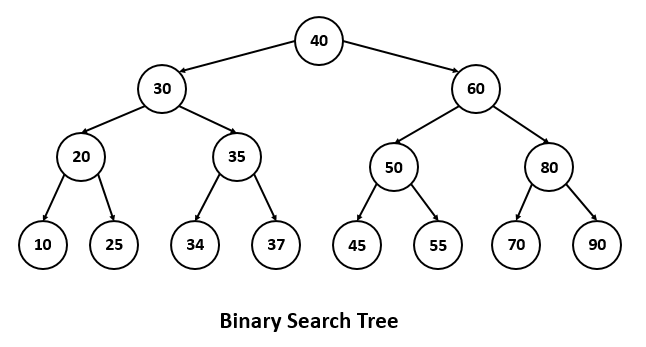
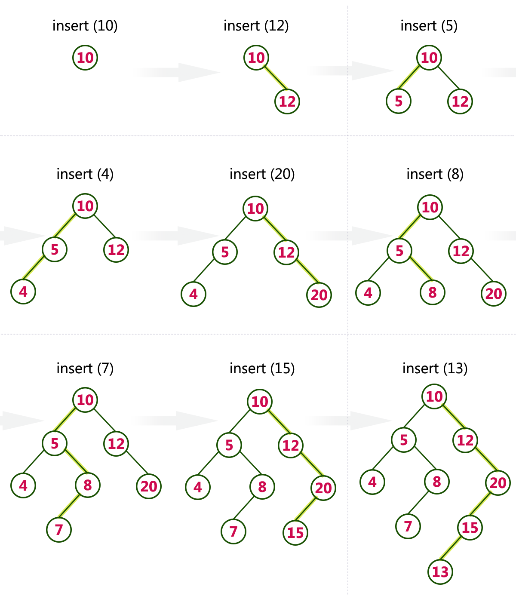

# Contenidos

* Árboles.
* Árbol binario.
* Recorrido in-order, post-order, pre-order.

## Árboles

Está compuesto por 0 o más nodos.

Cada nodo tiene:
  - Dos punteros a los hijos: Uno para el hijo izquierdo, otro para el hijo derecho.
  - Información.

Así como en listas teníamos el nodo Head para acceder a la lista, en árboles tenemos el nodo root(raiz), desde este nodo se construye el árbol.

Un nodo que no tiene hijos se considera como un nodo hoja.

#### Atributos

* Tamaño: Cantidad de nodos que componen el árbol.
* Profundidad: Hay de 2 tipos
  - De nodo: Distancia entre el nodo y la raiz.
  - De árbol: Distancia entre la raiz y el nodo de mayor profundidad.
* Árbol balanceado: Árbol que tiene todos los niveles completos.

## Árbol binario de búsqueda

Árbol en que cada los hijos izquierdo de cada nodo sean menores que el y los hijos derechos sean mayores. Útil para encontrar información.





#### Recorrido de un árbol binario

Se comienza con la raiz del árbol y luego se realizan 3 acciones.

* In-order: Se recorre primero el lado izquierdo del árbol, luego la raiz y finalmente el lado derecho del árbol, o dicho de otra manera, de menor a mayor.
  - Atraviese el sub-árbol izquierdo
  - Visite la raíz
  - Atraviese el sub-árbol derecho
* Pre-order: Se recorre primero la raiz y luego los sub-árboles
  - Visite la raíz
  - Atraviese el sub-árbol izquierdo
  - Atraviese el sub-árbol derecho
* Post-order: Se recorre primero cada sub-árbol y finalmente la raiz
  - Atraviese el sub-árbol izquierdo
  - Atraviese el sub-árbol derecho
  - Visite la raíz


#### Implementación


```python
class Node:
    def __init__(self, value):
        self.left = None
        self.right = None
        self.value = value

class ABB:
    def __init__(self, value):
        self.root = None

    def empty(element):
        return self.root == None

    def __add(self, value, node):
        if value < node.value:
            if node.left == None:
                node.left = Node(value)
                return
            self.__add(value, node.left)
        elif value > node.value:
            if node.right == None:
                node.right = Node(value)
                return
            self.__add(value, node.right)

    def add(self, value):
        if self.empty():
            node = Node(value)
            self.root = node
        else:
            __add(self, value, self.root)

    def __search(self, value, node):
        if value == node.value:
            return True
        elif value < node.value:
            self.__search(self, value, node.left)
        else:
            self.__search(self, value, node.right)

    def search(self, value):
        if self.empty():
            return False
        else:
            self.__search(self, value, self.root)

    def delete(): #Implementar
        pass

    def in_order(): #Implementar
        pass

    def post_order(): #Implementar
        pass

    def pre_order(): #Implementar
        pass

    def leaf_number(): #Implementar
        pass

    def tree_height(): #Implementar
        pass

    def node_height(): #Implementar
        pass

    def find_minimum(): #Implementar
        pass

    def find_maximum(): #Implementar
        pass
```
