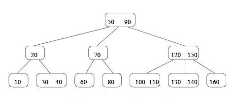
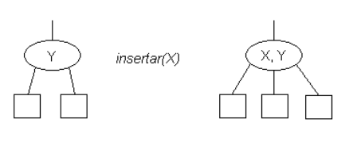

# Ayudantía 8

### Contenidos

* Árboles 2-3

### Árboles 2-3

Es un árbol en donde los nodos interiores pueden contener hasta 2 elementos y, además, pueden
tener 2 o 3 hijos, dependiendo de cuántos elementos posea el nodo. Por ello, siempre estarán
“perfectamente” balanceados tras insertar o borrar elementos, por lo que el algoritmo de búsqueda es casi tan rápido como en un árbol de búsqueda de altura mínima. Por otro lado, es mucho más fácil de mantenerlo.

Una propiedad que poseen los árboles 2-3 es que todas sus hojas están a la misma profundidad.

#### Orden de los elementos

Por definición, los pesos de los nodos siguen “una norma” similar a la de los árboles  binarios, solo que, al poder tener 2 elementos (pesos) en cada nodo y hasta 3 nodos hijos (por cada padre). Por ello, estaríamos frente a los siguientes casos:

#### Ejemplo

#### Inserción

Se deben manejar dos casos:

1. El nodo donde se insertará el dato posee dos datos (datos Y y Z) y tres enlaces
En este caso se obtendrá un nodo padre con dos hijos donde se respeta que X < Y < Z donde X, Y y Z son los datos “de peso” de los nodos.

2. El nodo donde se insertará el dato posee un dato (dato Y) y dos enlaces
En este caso se obtendrá un nodo padre con tres hijos Nulos y con dos elementos donde se
respeta que si X < Y los datos ordenados serán X,Y respectivamente. Por ejemplo:

#### Eliminación

Dada la particularidad de estos árboles, y al igual que en la inserción, tenemos que manejar dos casos al momento de eliminar un elemento Z:

1. El nodo donde se encuentra Z tiene dos elementos
En este caso se elimina Z y el nodo queda con un solo elemento.

2. El nodo donde se encuentra Z tiene un elemento
Es importante notar que, para mantener el balance del árbol deberemos observar al “nodo
hermano” y/o al nodo “padre” del nodo con el elemento Z ya que es diferente si este posee un
elemento o dos.

### Ejercicios

1. Implemente la clase `Nodo` para un árbol 2-3.
2. Implemente un árbol 2-3 con métodos para insertar, buscar y eliminar elementos.