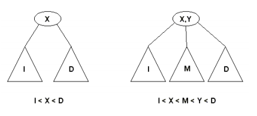
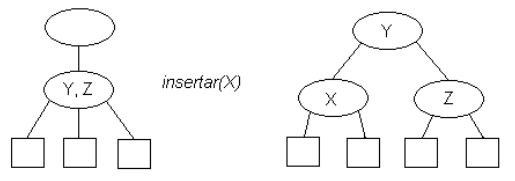
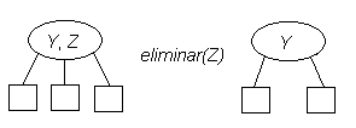
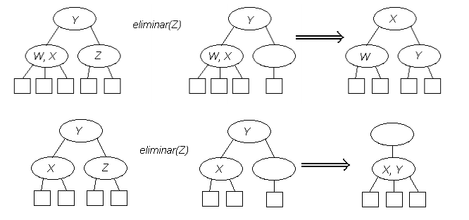
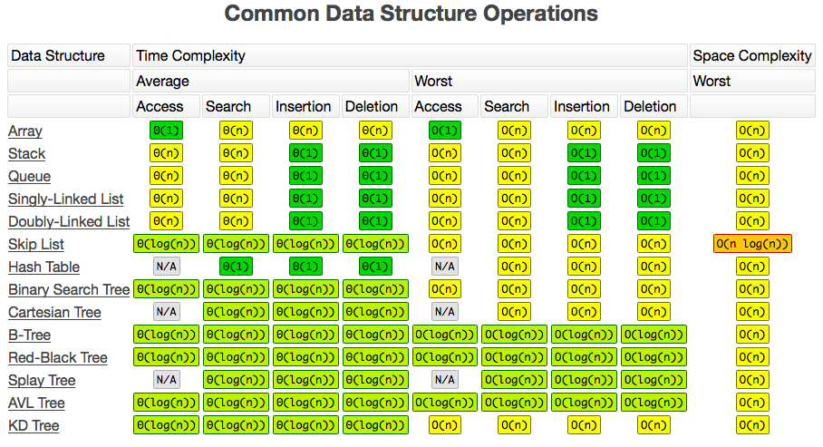
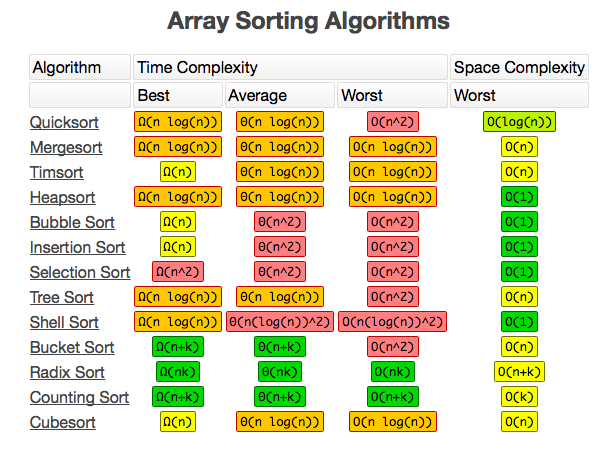

# Contenidos
* Repaso árboles
    * Binario
    * **AVL**
    * 2-3
* Orden de complejidad
* Análisis código de Hash

## Árboles

### Propiedades
* Compuesto por 0 o más nodos
* Cada nodo contiene:
    * Dos puntejos hijos (derecho e izquierdo)
    * Valor
* Se construyen a partir del nodo raiz (root)
* Hoja: Se le llama al nodo que no tiene hijos
* Altura: La profundidad o altura de un árbol es el máximo nivel de cualquier hoja en el árbol.

### Árbol binario de búsqueda

Árbol en que cada los hijos izquierdo de cada nodo sean menores que el y los hijos derechos sean mayores. Útil para encontrar información.

#### Recorrido
* In-order: Se recorre primero el lado izquierdo del árbol, luego la raiz y finalmente el lado derecho del árbol, o dicho de otra manera, de menor a mayor.
  - Atraviese el sub-árbol izquierdo
  - Visite la raíz
  - Atraviese el sub-árbol derecho
* Pre-order: Se recorre primero la raiz y luego los sub-árboles
  - Visite la raíz
  - Atraviese el sub-árbol izquierdo
  - Atraviese el sub-árbol derecho
* Post-order: Se recorre primero cada sub-árbol y finalmente la raiz
  - Atraviese el sub-árbol izquierdo
  - Atraviese el sub-árbol derecho
  - Visite la raíz


### AVL

Es un tipo especial de árbol binario el cual es auto-balanceable.

Los árboles AVL están siempre equilibrados de tal modo que para todos los nodos, la altura del sub-árbol izquierdo no difiere en más de una unidad de la altura del sub-árbol derecho o viceversa. 

La complejidad de una búsqueda en uno de estos árboles se mantiene siempre en orden de complejidad O(log n).

### Factor de equilibrio

El factor de equilibrio es la diferencia entre las alturas del sub-árbol derecho y el izquierdo:

    FE = altura sub-árbol derecho - altura sub-árbol izquierdo

Por definición, para un árbol AVL, este valor debe ser -1, 0 ó 1.

Si el factor de equilibrio de un nodo es:

    0 -> el nodo está equilibrado y sus subárboles tienen exactamente la misma altura.
    1 -> el nodo está equilibrado y su subárbol derecho es un nivel más alto.
    -1 -> el nodo está equilibrado y su subárbol izquierdo es un nivel más alto.

Si el factor de equilibrio |Fe|>=2 es necesario reequilibrar.

### Rotaciones
Las rotaciones se realizan para mantener el árbol perfectamente balanceado. El balanceo se produce de abajo hacia arriba sobre los nodos en los que se produce el desequilibrio. Pueden darse dos casos: rotación simple o rotación doble; a su vez ambos casos pueden ser hacia la derecha o hacia la izquierda.

* Rotación simple a la derecha

    De un árbol de raíz (r) y de hijos izquierdo (i) y derecho (d), lo que haremos será formar un nuevo árbol cuya raíz sea la raíz del hijo izquierdo. Como hijo izquierdo colocamos el hijo izquierdo de i y como hijo derecho construimos un nuevo árbol que tendrá como raíz, la raíz del árbol, el hijo derecho de i será el hijo izquierdo y el hijo derecho será el hijo derecho del árbol.


* Rotación simple a la izquierda

    De un árbol de raíz (r) y de hijos izquierdo (i) y derecho (d), consiste en formar un nuevo árbol cuya raíz sea la raíz del hijo derecho, como hijo derecho colocamos el hijo derecho de d (nuestro d’) y como hijo izquierdo construimos un nuevo árbol que tendrá como raíz la raíz del árbol (r), el hijo izquierdo de d será el hijo derecho (i’) de r y el hijo izquierdo será el hijo izquierdo del árbol (i).

    Precondición : Tiene que tener hijo derecho no vacío.

    Si la inserción se produce en el hijo derecho del hijo izquierdo del nodo desequilibrado (o viceversa) hay que realizar una doble rotación.

* Rotación doble a la derecha

    La Rotación doble a la Derecha son dos rotaciones simples, primero rotación simple izquierda y luego rotación simple derecha.

* Rotación doble a la izquierda

    kLa Rotación doble a la Izquierda son dos rotaciones simples, primero rotación simple derecha y luego rotación simple izquierda.

### Árboles 2-3

Es un árbol en donde los nodos interiores pueden contener hasta 2 elementos y, además, pueden tener 2 o 3 hijos, dependiendo de cuántos elementos posea el nodo. Por ello, siempre estarán“perfectamente” balanceados tras insertar o borrar elementos, por lo que el algoritmo de búsqueda es casi tan rápido como en un árbol de búsqueda de altura mínima. Por otro lado, es mucho más fácil de mantenerlo.

Una propiedad que poseen los árboles 2-3 es que todas sus hojas están a la misma profundidad.

#### Orden de los elementos

Por definición, los pesos de los nodos siguen “una norma” similar a la de los árboles  binarios, solo que, al poder tener 2 elementos (pesos) en cada nodo y hasta 3 nodos hijos (por cada padre). Por ello, estaríamos frente a los siguientes casos:



#### Inserción

Se deben manejar dos casos:

    1. El nodo donde se insertará el dato posee dos datos (datos Y y Z) y tres enlaces
En este caso se obtendrá un nodo padre con dos hijos donde se respeta que X < Y < Z donde X, Y y Z son los datos “de peso” de los nodos.



    2. El nodo donde se insertará el dato posee un dato (dato Y) y dos enlaces
En este caso se obtendrá un nodo padre con tres hijos Nulos y con dos elementos donde se
respeta que si X < Y los datos ordenados serán X,Y respectivamente. Por ejemplo:


#### Eliminación

Dada la particularidad de estos árboles, y al igual que en la inserción, tenemos que manejar dos casos al momento de eliminar un elemento Z:

    1. El nodo donde se encuentra Z tiene dos elementos
En este caso se elimina Z y el nodo queda con un solo elemento.



    2. El nodo donde se encuentra Z tiene un elemento
Es importante notar que, para mantener el balance del árbol deberemos observar al “nodo
hermano” y/o al nodo “padre” del nodo con el elemento Z ya que es diferente si este posee un
elemento o dos.



## Orden de complejidad

En las ciencias de la computación, el tiempo de complejidad u orden de complejidad de un algoritmo cuantifica la cantidad de tiempo que le toma a un algoritmo ejecutar una función según el largo de su input.

### Notación
“O” se refiere a la notación Big O y “n” se refiere al tamaño del input - ya sean caracteres en un string, objetos en una lista o números en un arreglo.

### Ordenes comunes

| Notacion   | Nombre                   |
| ---------- | ------------------------ |
| O(1)       | Orden constante          |
| O(log n)   | Orden logarítmico        |
| O(n log n) | Orden lineal logaritmico |
| O(n)       | Orden lineal             |
| O(n^2)     | Orden cuadrático         |
| O(n^3)     | Orden cúbico             |
| O(c^n)     | Orden exponencial, n > 1 |

* O(1): Operaciones, comparaciones, ciclos definidos
* O(log n): Aquellos donde cada nueva operación tomará la mitad de tiempo con respecto a la anterior. Ejemplo en árboles binarios / búsqueda binaria
* O(n): Cuando el tiempo que se demora en ejecutar es dependiente del largo del input. Ejemplo: Copiar, buscar en listas y operaciones que necesiten analizar todos los elementos.
* O(n^c): Cuando ujn algoritmo es limitado superiormente por una expresión polinomial según el tamaño del input. Ejemplo: Selection sort / bubble sort

### Estructuras de datos y sus órdenes de complejidad




## Análisis código hash

```python
def str2num(key):
  return sum([ord(c) for c in key])

def hashstr(key,size):
  return str2num(key)%size


class hash:
  def __init__(self,size):
    self.list = [None]*size
    self.size= size
  
  def put(self,key,val):
    pos = hashstr(key,self.size)
    if self.list[pos] is not None:
      print("collision "+key+"<br>")
      ok = False
      for t in self.list[pos]:
        if t[0] is key:
          t[1] = val
          ok = True
      if not ok:
        self.list[pos].append([key,val])
    else:
      self.list[pos] =[]
      self.list[pos].append([key,val])
    
  def get(self,key):
    for e in self.list[hashstr(key,self.size)]:
      if e[0] is key:
        return e[1]
      
h = hash(10)
h.put("fruta","")
h.put("verdura","")
h.put("chatarra","")
h.put("chatarra","")
h.put("mesa","")
h.put("same","")
h.put("mase","")

print(h.get("fruta")+"<br>")
print(h.get("verdura")+"<br>")
print(h.get("chatarra")+"<br>")
print(h.get("mesa")+"<br>")
print(h.get("same")+"<br>")
print(h.get("mase")+"<br>")
```